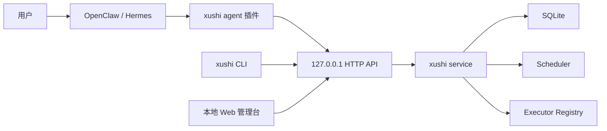

# 序时 xushi 技术方案文档

## 1. 架构概览

序时 v1 采用混合架构：

- `xushi-daemon`：Python 本地服务，负责调度、存储、执行器调用、跟进和 API。
- `xushi` CLI：命令行客户端，复用同一应用服务。
- 本地 Web 管理台：由 daemon 提供，用于查看任务和运行记录。
- OpenClaw 插件：TypeScript 原生插件，是 v1 优先适配的集成入口之一，运行在 OpenClaw 内，将 agent 工具调用转发到本地 daemon。
- xushi-skills：任务类型指南包，指导 agent 选择任务类型、追问缺失信息并生成 xushi task JSON。当前安装脚本支持把它安装到 OpenClaw 和 Hermes 的 skills 目录。



## 2. 技术栈

- Python 3.12+，当前开发环境为 Python 3.14。
- `uv` 管理依赖和运行命令。
- FastAPI 提供本地 HTTP API。
- SQLite 存储任务、运行记录和通知事件；executor 配置由本地配置文件管理。
- Pydantic 定义结构化任务契约。
- `python-dateutil` 解析 RRULE。
- Typer 提供 CLI。
- OpenClaw 插件使用 TypeScript/ESM。
- PyInstaller 用于生成 `xushi` 与 `xushi-daemon` 跨平台预编译二进制。

## 3. 核心模块

- `xushi.models`：任务、调度、跟进、运行记录、执行器模型。
- `xushi.scheduler`：计算到期触发、错过补偿和未完成跟进。
- `xushi.calendar`：中国工作日日历与调休判断。
- `xushi.storage`：SQLite 持久化。
- `xushi.config`：配置文件、环境变量覆盖和本地 token 初始化。
- `xushi.service`：应用服务层。
- `xushi.api`：本地 HTTP API 和 Web 管理台。
- `xushi.cli`：命令行入口。
- `xushi.upgrade`：手动 CLI 安全升级、备份和回滚。
- `plugins/openclaw-xushi`：OpenClaw 原生插件。
- `src/xushi/bundled_plugins/openclaw-xushi`：随应用版本携带的 OpenClaw 插件副本，用于 `xushi plugins install`。
- `skills/xushi-skills`：任务类型指南包源码，包含核心工作流、任务类型指南、schema 模板、澄清问题清单和优化反馈记录模板。OpenClaw 和 Hermes 优先通过插件、executor 或 webhook 集成，并可加载同一套 `SKILL.md` 指南。
- `src/xushi/bundled_skills/xushi-skills`：随应用版本携带的 skills 副本，用于 `xushi skills install`。
- `xushi.executors`：OpenClaw 与 Hermes 执行器调用；通用 webhook executor 暂时仅保留预留位置。

## 4. API 设计

默认绑定 `127.0.0.1:18766`，通过 `Authorization: Bearer <token>` 鉴权。

- `GET /api/v1/health`
- `POST /api/v1/tasks`
- `GET /api/v1/tasks`
- `GET /api/v1/tasks/{id}`
- `PATCH /api/v1/tasks/{id}`
- `DELETE /api/v1/tasks/{id}`
- `POST /api/v1/tasks/{id}/runs`
- `POST /api/v1/tasks/{id}/runs/confirm-latest`
- `GET /api/v1/runs` 支持 `task_id`、`status`、`active_only` 和 `limit` 查询参数。
- `POST /api/v1/runs/{id}/confirm`
- `POST /api/v1/runs/{id}/callback`
- `GET /api/v1/notifications`
- `GET /api/v1/deliveries`
- `POST /api/v1/deliveries/retry`
- `POST /api/v1/config/reload`
- `GET /api/v1/executors` 是只读接口，返回当前 daemon 运行时加载的 executor 配置。

成功和错误响应都使用统一结构：

```json
{
  "status": 200,
  "code": 200,
  "message": "ok",
  "data": {},
  "errors": []
}
```

## 5. 数据模型

SQLite 当前以 JSON payload 方式保存核心对象，便于 v1 快速演进 schema；同时把高频查询字段冗余为结构化列并建立索引，避免调度、确认和投递路径随着历史记录增长退化为全量扫描。结构化时间列统一保存为 UTC ISO 字符串，payload 继续保留原始带时区时间，兼顾查询排序和可读审计。

- `tasks`：任务 payload、状态、创建时间、更新时间、`idempotency_key` 和 `idempotency_hash`。
- `runs`：运行记录 payload、任务 ID、原始运行 ID、调度时间、状态和确认时间。运行状态包括 `pending_delivery`、`succeeded`、`failed`、`pending_confirmation`、`following_up` 和 `cancelled`。
- `deliveries`：每次 run 的投递计划、原始到期时间、实际投递时间、延迟/聚合状态和投递结果。
- `notifications`：通知事件 payload、创建时间、投递状态。

SQLite 使用 `PRAGMA user_version` 标记 schema 版本。启动时会创建缺失表、为旧库补齐结构化列、从 payload 回填可索引字段，并创建关键索引：`tasks(status, created_at)`、`tasks(idempotency_key)`、`runs(task_id, status, scheduled_for)`、`runs(origin_run_id, status)`、`deliveries(status, deliver_at)` 和 `deliveries(run_id, status)`。幂等键索引为 partial unique index，仅约束非空键。

所有对外输入和持久化 payload 中的具体时间点都必须是 timezone-aware datetime，并以 ISO 8601/RFC3339 字符串保存，保留 `Z` 或 `+08:00` 等 offset。`Schedule` 额外保留 `timezone` 作为本地日历语义时区；该字段使用 IANA 名称，用于解释 RRULE 的 `BYHOUR/BYMINUTE/BYDAY`、工作日策略和任务级本地规则。全局或任务级 `quiet_policy.timezone` 则作为投递层的用户体验时区，delivery 在判断免打扰窗口前会把到期 instant 转换到该时区。

SQLite 连接按操作短连接打开并立即关闭，避免 Windows 下 daemon、测试或安装器清理数据文件时遇到文件句柄占用。

配置优先级为环境变量高于配置文件高于默认值。默认配置文件位于状态目录下的 `config.json`，`xushi init` 可生成本地 token、SQLite 路径、监听地址、端口、后台扫描间隔和默认 executor 列表；`xushi doctor` 用于检查配置文件、数据库目录、端口占用和 executor 诊断，帮助 agent 插件给出可执行的错误提示。executor 诊断不输出真实 token，只输出 `token_env` 是否存在于当前进程、是否使用内联 token、OpenClaw `agent_id` 是否缺失、`insecure_tls` 与 URL scheme 是否明显不匹配，以及 TLS 场景提示。

Executor 是本地配置，不属于运行态数据。`Settings.executors` 从 `config.json` 的 `executors` 数组加载，service 在启动时构建启用 executor 映射。修改 executor 或全局 `quiet_policy` 后可调用 `POST /api/v1/config/reload` 显式重新读取配置；reload 只替换内存中的 executor 列表、启用 executor 映射和 `QuietPolicyEngine`，不切换数据库路径、监听地址、端口、API token 或调度间隔。配置解析失败时 API 返回错误并保留旧运行时配置。`GET /api/v1/executors` 用于查看当前 daemon 运行时加载的 executor，CLI `xushi executors` 用于查看本地配置文件解析结果；两者都不提供写入接口，避免 agent 在运行时把投递凭据或外部入口写入 SQLite。

OpenClaw executor 使用 `mode=hooks_agent`。序时将 `action.payload` 转换为 OpenClaw `/hooks/agent` 请求体，字段包括 `message`、`name`、`agentId`、`wakeMode`、`deliver`、`channel`、`to`、`model`、`fallbacks`、`thinking` 和 `timeoutSeconds`。executor config 使用 snake_case，例如 `agent_id`、`wake_mode`、`timeout_seconds`，同时兼容 OpenClaw 的 camelCase 字段。token 优先从 executor 的 `token` 读取，其次从 `token_env` 或默认环境变量 `OPENCLAW_HOOKS_TOKEN` / `OPENCLAW_WEBHOOK_TOKEN` 读取。`insecure_tls` 默认 false，只有 OpenClaw Gateway 使用本机自签名 HTTPS 时才应显式启用。

Hermes executor 使用 `mode=agent_webhook` 或兼容别名 `webhook`。序时将 `action.payload` 转换为可配置 HTTP 请求体，默认字段为 `prompt`、`source` 和 `metadata`，并支持通过 `message_field` 调整提示词字段名。Hermes config 支持 `webhook_url`、`token`、`token_env`、`token_required`、`agent_id`、`conversation_id`、`channel`、`to`、`model`、`thinking`、`deliver`、`request_timeout_seconds`、`insecure_tls` 和 `body`/`extra_body` 追加字段。token 默认从 `HERMES_API_TOKEN` 或 `HERMES_TOKEN` 读取。通用 webhook executor 暂时仅保留 schema 位置，调用时返回 `reserved but not implemented`。v1 不提供 command executor，避免跨平台 shell、命令注入和环境差异扩大配置复杂度。`reminder` action 在配置 `executor_id` 时会走对应 executor；没有 `executor_id` 时才走本地系统通知。

长任务可在启动后异步回调 `POST /api/v1/runs/{id}/callback`，将运行记录更新为 `succeeded` 或 `failed`，并合并最终结果。

`Run` 使用 `origin_run_id` 将跟进记录关联到原始运行记录。用户或 agent 确认任一跟进记录后，序时会同步确认原始运行记录，并将同源仍在 `following_up` 或 `pending_confirmation` 的跟进记录标记为 `cancelled`。确认原始运行记录或归档任务时，也会取消关联的待处理跟进，避免历史 run 干扰 agent 判断。

`confirm-latest` 在服务层只选择指定任务最近一条未确认主运行记录，不确认跟进记录、失败记录或已取消记录。该接口主要服务 agent 的自然语言完成确认场景，例如用户说“刚才喝水了”，agent 已知喝水任务 ID 时无需先列出全部运行记录。

中国大陆 2026 年节假日数据存放在 `xushi/data/china_holidays_2026.json`，来源为国务院办公厅《关于2026年部分节假日安排的通知》。数据按节日名称分组，`holidays` 和 `adjusted_workdays` 均包含 `name` 与 `dates`，运行时展开为 `date -> name` 映射。`ChinaWorkdayCalendar.holiday_name()` 返回法定节假日名称，`adjusted_workday_name()` 返回调休工作日关联的节日名称。

## 6. 可靠性策略

- 调度语义采用“至少触发一次”。
- 每次触发创建 `Run` 记录。
- `missed_policy=catch_up_latest` 默认只补最近一次错过触发。
- `expiry` 到期后不再补发，适合抢购/抢票。
- `window` 任务在窗口打开时触发一次，窗口结束后不再补发。
- `deadline` 任务在截止时间到达后触发一次；`asap` 任务以任务创建时间作为尽快触发时间；`floating` 任务保留在待规划池，不自动触发。
- `calendar_policy=workday` 使用中国大陆工作日日历，将触发时间顺延到下一个工作日并保留原时刻。
- `anchor=completion` 的循环任务在上一条主运行记录确认完成后，基于确认时间重新计算下一次 RRULE 发生时间；未确认时不会继续生成主运行。
- scheduler 展开 recurring RRULE 前会把 `run_at`、`now`、上一条主运行和 `confirmed_at` 转换到 `schedule.timezone`，确保 `BYHOUR` 等规则按用户本地时区解释，而不是按输入 offset 偶然解释。
- scheduler 只负责判断任务到期并生成 `Run`；delivery 层负责判断是否立即投递、延迟到免打扰结束、聚合摘要、跳过、静默或绕过。
- `quiet_policy` 存放在用户配置中，支持多个 `windows`；每个窗口包含 `start`、`end`、`days` 和 `calendar`。`days=workdays/weekends` 复用 `ChinaWorkdayCalendar`，因此支持中国大陆调休。
- `TaskQuietPolicy` 默认 `mode=inherit`，新增任务自动继承用户级免打扰；任务可设置 `override`、`bypass`、`skip` 或 `silent`。
- `behavior=delay` 是默认免打扰行为。延迟 delivery 到达可投递时间后，如果同 executor 下有多条延迟提醒，使用 digest 聚合为一条摘要投递；原始 delivery 标记为 `digested`，原始 run 保持可审计和可确认。
- `idempotency_key` 用于 agent 重试安全。服务层为创建请求保存稳定 JSON 摘要；同 key 且同摘要时返回已有任务，同 key 但请求体不同则返回 `409 idempotency key conflict`，提醒 agent 修正重试逻辑。
- `FollowUpPolicy` 控制确认、宽限期、跟进间隔、最大次数和是否询问改期。
- 失败 delivery 不自动无限重试，避免配置错误时持续打扰外部系统；用户修复 executor token、URL、TLS 或 agent 路由配置后，可先通过 `POST /api/v1/config/reload` 或 CLI `xushi reload-config` 刷新运行时配置，若改的是 daemon 环境变量或启动级配置则重启 daemon，再通过 `POST /api/v1/deliveries/retry` 或 CLI `xushi retry-deliveries` 创建新的 retry delivery。原失败 delivery 保留为审计历史，新的 delivery 通过 `result.retry_of` 指向原记录，run 会回到 `pending_delivery` 后立即重新投递。
- FastAPI lifespan 启动后台调度循环，默认每 30 秒执行一次到期任务和跟进扫描。调度循环启动时输出 info 日志；每次 tick 创建 run 时输出摘要，空 tick 使用 debug 日志。

## 7. OpenClaw 插件设计

插件目录为 `plugins/openclaw-xushi`。

- `openclaw.plugin.json` 声明插件 ID、配置 schema、工具契约。
- `package.json#openclaw` 声明 TS 源入口和 JS 运行时入口。
- 注册工具：`xushi_health`、`xushi_create_task`、`xushi_list_tasks`、`xushi_get_task`、`xushi_trigger_task`、`xushi_list_runs`、`xushi_list_deliveries`、`xushi_retry_deliveries`、`xushi_reload_config`、`xushi_confirm_run`、`xushi_confirm_latest_run`、`xushi_callback_run`、`xushi_list_executors`、`xushi_install_hint`。
- `xushi_list_executors` 只查看当前 daemon 运行时加载的 executor；`xushi_reload_config` 显式刷新 executor 和全局免打扰策略。插件不提供保存 executor 工具。
- 插件读取 `XUSHI_BASE_URL` 和 `XUSHI_API_TOKEN`，默认连接本机 daemon。
- 插件 `openclaw.plugin.json` 和 `package.json` 的版本号必须与 `pyproject.toml` 应用版本保持一致，保证 ClawHub 发布、本地内置安装和 daemon API 契约同步。
- 插件仍保留 `plugins/openclaw-xushi` 源目录，用于开发、审查和 ClawHub 发布；应用发布时会将同一目录内容复制到 `src/xushi/bundled_plugins/openclaw-xushi`，由 `xushi plugins install/status` 管理本地安装。

## 8. 分发设计

- README 使用 GitHub 项目页风格，提供徽章、价值主张、能力表格、快速安装和验证入口。
- `docs/guide/installation.md` 提供两层安装说明：人类复制给 LLM Agent 的短提示词，以及 agent 可执行的分步安装与验证流程。
- `scripts/install.ps1` 和 `scripts/install.sh` 默认从 GitHub Release 下载当前平台的 `xushi` 与 `xushi-daemon` 二进制，安装到用户目录 `~/.xushi/bin`，并配置用户级 PATH，使 `xushi` 和 `xushi-daemon` 可作为全局命令使用。脚本随后执行 `xushi init --show-token` 和 `xushi doctor`。
- 安装指南优先说明 OpenClaw 插件、OpenClaw `/hooks/agent` executor 和 Hermes agent webhook 配置。
- 安装脚本支持 `XUSHI_INSTALL_AGENT_PLUGINS=openclaw` 或 `--agent-plugins openclaw`，在用户明确同意时调用当前安装的 `xushi plugins install openclaw` 非交互式安装内置 OpenClaw 插件。OpenClaw 插件默认写入 `${OPENCLAW_HOME:-~/.openclaw}/plugins/openclaw-xushi`；可通过 `XUSHI_OPENCLAW_PLUGINS_DIR`、shell 参数 `--openclaw-plugins-dir`，或 agent 已有的 `OPENCLAW_PLUGINS_DIR` 改写 plugins 根目录；已有同名插件时先备份为带时间戳的目录。
- 安装脚本支持 `XUSHI_INSTALL_AGENT_SKILLS=openclaw,hermes` 或 `--agent-skills openclaw,hermes`，在用户明确同意时调用当前安装的 `xushi skills install` 非交互式安装内置 `xushi-skills`。OpenClaw 目标默认写入 `${OPENCLAW_HOME:-~/.openclaw}/skills/xushi-skills`；Hermes 目标默认写入 `${HERMES_HOME:-~/.hermes}/skills/xushi-skills`；可通过 `XUSHI_OPENCLAW_SKILLS_DIR` / `XUSHI_HERMES_SKILLS_DIR`、shell 参数 `--openclaw-skills-dir` / `--hermes-skills-dir`，或 agent 已有的 `OPENCLAW_SKILLS_DIR` / `HERMES_SKILLS_DIR` 改写 skills 根目录；已有同名 skill 时先备份为带时间戳的目录。
- `xushi-skills` 将喝水、起立、伸展、眼休息等健康习惯默认映射为 `recurring + anchor=completion + requires_confirmation=true`，并提示 agent 优先使用用户级 `quiet_policy` 处理夜间免打扰；同时提供 `references/optimization-notes.md`，要求 agent 把真实使用中的问题、前因后果、预期效果和可行动方向记录为本地反馈草稿，不自动上传。
- `xushi skills status` 输出当前应用版本、内置 skills 版本和目标目录安装版本；`xushi skills install` 从应用包数据复制内置 skills，不再从 Release 下载独立 zip。
- `uv build --wheel` 生成 Python wheel，适合开发者和 Python 用户安装。
- `scripts/build_binaries.py` 通过 PyInstaller 生成 `xushi` 和 `xushi-daemon` 单文件二进制。
- PyInstaller 构建使用 `--collect-data xushi`，确保中国节假日 JSON 等包数据被包含在二进制中。
- `.github/workflows/build.yml` 在 Windows、macOS、Linux 上执行测试、ruff、wheel 构建和二进制构建，并上传已按平台重命名的构建产物，不上传 PyInstaller 临时 `.spec` 文件。
- `scripts/prepare_release_assets.py` 负责将 PyInstaller 二进制重命名为 `xushi-<platform>`、`xushi-daemon-<platform>`，并复制 Python wheel/sdist。
- OpenClaw 插件和 `xushi-skills` 均作为 `xushi` 包数据随 wheel 和 PyInstaller 二进制携带；Release 不再发布独立 plugin/skills zip，避免应用程序、插件和 skills 版本错配。公开插件分发走 ClawHub 发布流程，而不是 GitHub Release 附件。
- `.github/workflows/release.yml` 在 `v*` tag 上先运行跨平台质量检查，再分别构建 Python 包和平台二进制，最后合并 release 资产、生成 `SHA256SUMS.txt` 并发布 GitHub Release 自动说明。
- `xushi upgrade status/check/backup/apply/rollback` 提供用户手动触发的安全升级能力。升级器默认不做静默自动升级；`apply` 先检查 daemon 端口，再备份配置和 SQLite 数据库，随后从 GitHub Release 下载目标版本或 latest 的 `xushi-<platform>` 与 `xushi-daemon-<platform>`，替换用户级全局命令目录中的二进制。
- 升级备份存放在配置目录的 `backups/upgrade-<timestamp>` 下，包含 `config.json`、通过 SQLite backup API 生成的一致性数据库快照、存在的 WAL/SHM sidecar 和 `manifest.json`。`rollback` 根据 manifest 恢复原路径，恢复主数据库前会清理现有 WAL/SHM sidecar，避免旧 sidecar 干扰恢复数据。
- `.gitattributes` 固定 shell、Python、Markdown、YAML、JSON、TOML、TS/JS 为 LF，PowerShell 脚本为 CRLF，避免跨平台安装脚本换行损坏。
- 项目根目录提供 MIT License，`pyproject.toml` 声明 `license = "MIT"`。
- 项目根目录提供 `CONTRIBUTING.md` 和 `SECURITY.md`，`.github` 下提供 Issue 模板和 PR 模板，统一外部反馈格式。

## 9. 方案变更记录

| 日期 | 类型 | 内容 |
| ---- | ---- | ---- |
| 2026-05-09 | 新增 | 创建 Python daemon + TypeScript OpenClaw 插件的 v1 技术方案。 |
| 2026-05-09 | 明确 | 增加后台调度循环、运行记录确认接口、跟进记录关联和 OpenClaw 确认工具。 |
| 2026-05-09 | 明确 | 增加数据文件驱动的中国大陆 2026 年节假日与调休日历。 |
| 2026-05-09 | 明确 | OpenClaw executor 从模板占位升级为真实投递探索，后续收敛到 `/hooks/agent`。 |
| 2026-05-09 | 新增 | 增加长任务 callback API 和 OpenClaw callback 工具。 |
| 2026-05-09 | 新增 | 增加配置文件初始化、环境变量覆盖和 CLI doctor 诊断设计。 |
| 2026-05-09 | 明确 | 实现窗口、截止、待规划、完成锚点和工作日顺延调度规则。 |
| 2026-05-09 | 新增 | 增加 asap 调度、幂等创建和统一 API 错误响应。 |
| 2026-05-09 | 新增 | 增加 PyInstaller 二进制构建脚本和跨平台 CI 构建工作流。 |
| 2026-05-09 | 调整 | 中国大陆节假日数据结构改为按节日名称分组，并在日历模块暴露节日名称查询。 |
| 2026-05-09 | 新增 | 增加 GitHub 风格 README、MIT License、agent 安装指南和跨平台安装脚本。 |
| 2026-05-09 | 新增 | 增加 `.gitattributes` 跨平台换行规范和 tag 发布 Release 工作流。 |
| 2026-05-09 | 新增 | 增加社区健康文件、Issue 模板和 PR 模板。 |
| 2026-05-09 | 更正 | 修复 reminder action 忽略 executor 的路由问题，并补充 OpenClaw executor 接入能力。 |
| 2026-05-10 | 更正 | 撤回早期 command bridge 方案，避免跨平台和安全边界复杂度。 |
| 2026-05-10 | 调整 | OpenClaw 默认投递链路从 TaskFlow webhook 调整为 `/hooks/agent`，并新增 `hooks_agent` 载荷适配。 |
| 2026-05-10 | 调整 | 移除 command executor；通用 webhook executor 暂时仅返回预留未实现状态。 |
| 2026-05-10 | 明确 | 完善 OpenClaw `/hooks/agent` 可选字段映射，支持 snake_case 与 camelCase 配置别名。 |
| 2026-05-10 | 调整 | OpenClaw HTTPS 自签名证书改为显式 `insecure_tls` 配置，默认保持 TLS 证书校验。 |
| 2026-05-10 | 调整 | executor 配置从 SQLite/API 写入调整为 `config.json` 管理，API 和 OpenClaw 插件仅保留只读查看能力。 |
| 2026-05-10 | 调整 | 默认 daemon 端口从 `8766` 调整为 `18766`，避开低位常见开发端口并保留旧端口记忆点。 |
| 2026-05-10 | 调整 | 重构 GitHub Release workflow，拆分质量检查、Python 包、平台二进制和发布步骤，增加唯一资产命名、插件 zip 和 SHA256 校验和。 |
| 2026-05-10 | 新增 | 增加手动 CLI 安全升级设计，提供 status/check/backup/apply/rollback，并在升级前使用 SQLite backup API 创建可回滚备份。 |
| 2026-05-10 | 调整 | 安装与升级实现改为 GitHub Release 二进制下载，默认写入 `~/.xushi/bin` 并配置全局命令。 |
| 2026-05-10 | 调整 | Hermes executor 从预留未实现升级为可配置 HTTP agent webhook 适配。 |
| 2026-05-10 | 新增 | 增加 `xushi-skills` agent skill 包、Release 打包和安装脚本静默安装参数。 |
| 2026-05-10 | 新增 | 增加运行记录过滤、按任务确认最近待确认 run、取消同源跟进记录和 xushi 优化反馈 skill 模板。 |
| 2026-05-10 | 更正 | 暂时移除 Codex skill 安装目标，安装脚本仅支持 OpenClaw/Hermes skills 目录。 |
| 2026-05-10 | 明确 | 安装脚本支持 OpenClaw/Hermes 自定义 skills 根目录，避免 agent 目录调整后写入默认位置。 |
| 2026-05-10 | 调整 | 将免打扰从 scheduler 调整为 delivery 层通用策略，新增 Delivery 模型、全局/任务级 quiet policy 和摘要聚合。 |
| 2026-05-10 | 调整 | `xushi-skills` 改为随应用包数据内置，新增 `xushi skills install/status`，Release 不再发布独立 skills zip。 |
| 2026-05-10 | 调整 | OpenClaw 插件改为随应用包数据内置，新增 `xushi plugins install/status`，Release 不再发布独立插件 zip，ClawHub 保留为公开插件分发通道。 |
| 2026-05-10 | 明确 | 增强 `xushi doctor` executor 诊断、后台 scheduler 日志和失败 delivery 手动重试链路。 |
| 2026-05-11 | 明确 | 增加 timezone-aware datetime 不变量，并规定 RRULE 与免打扰窗口按显式 IANA 时区解释。 |
| 2026-05-11 | 新增 | 增加显式配置 reload API，仅热更新 executor 和全局免打扰策略，启动级配置仍需重启。 |
| 2026-05-11 | 调整 | 增加 SQLite schema 迁移、结构化查询索引和幂等请求摘要冲突检测。 |
