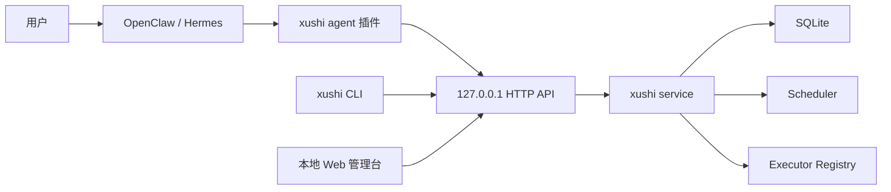

# 序时 xushi 技术方案文档

## 1. 架构概览

序时 v1 采用混合架构：

- `xushi-daemon`：Python 本地服务，负责调度、存储、执行器调用、跟进和 API。
- `xushi` CLI：命令行客户端，复用同一应用服务。
- 本地 Web 管理台：由 daemon 提供，用于查看任务和运行记录。
- OpenClaw 插件：TypeScript 原生插件，运行在 OpenClaw 内，将 agent 工具调用转发到本地 daemon。



## 2. 技术栈

- Python 3.12+，当前开发环境为 Python 3.14。
- `uv` 管理依赖和运行命令。
- FastAPI 提供本地 HTTP API。
- SQLite 存储任务、运行记录和执行器。
- Pydantic 定义结构化任务契约。
- `python-dateutil` 解析 RRULE。
- Typer 提供 CLI。
- OpenClaw 插件使用 TypeScript/ESM。
- PyInstaller 用于生成 `xushi` 与 `xushi-daemon` 跨平台预编译二进制。

## 3. 核心模块

- `xushi.models`：任务、调度、跟进、运行记录、执行器模型。
- `xushi.scheduler`：计算到期触发、错过补偿和未完成跟进。
- `xushi.calendar`：中国工作日日历与调休判断。
- `xushi.storage`：SQLite 持久化。
- `xushi.config`：配置文件、环境变量覆盖和本地 token 初始化。
- `xushi.service`：应用服务层。
- `xushi.api`：本地 HTTP API 和 Web 管理台。
- `xushi.cli`：命令行入口。
- `plugins/openclaw-xushi`：OpenClaw 原生插件。
- `xushi.executors`：command/webhook/OpenClaw/Hermes 执行器调用。

## 4. API 设计

默认绑定 `127.0.0.1`，通过 `Authorization: Bearer <token>` 鉴权。

- `GET /api/v1/health`
- `POST /api/v1/tasks`
- `GET /api/v1/tasks`
- `GET /api/v1/tasks/{id}`
- `PATCH /api/v1/tasks/{id}`
- `DELETE /api/v1/tasks/{id}`
- `POST /api/v1/tasks/{id}/runs`
- `GET /api/v1/runs`
- `POST /api/v1/runs/{id}/confirm`
- `POST /api/v1/runs/{id}/callback`
- `GET /api/v1/notifications`
- `GET /api/v1/executors`
- `POST /api/v1/executors`

成功和错误响应都使用统一结构：

```json
{
  "status": 200,
  "code": 200,
  "message": "ok",
  "data": {},
  "errors": []
}
```

## 5. 数据模型

SQLite 当前以 JSON payload 方式保存核心对象，便于 v1 快速演进 schema。后续稳定后可拆分索引字段。

- `tasks`：任务 payload、状态、创建时间、更新时间。
- `runs`：运行记录 payload、任务 ID、调度时间、状态。
- `executors`：执行器 payload、类型、启用状态。
- `notifications`：通知事件 payload、创建时间、投递状态。

SQLite 连接按操作短连接打开并立即关闭，避免 Windows 下 daemon、测试或安装器清理数据文件时遇到文件句柄占用。

配置优先级为环境变量高于配置文件高于默认值。默认配置文件位于状态目录下的 `config.json`，`xushi init` 可生成本地 token、SQLite 路径、监听地址、端口和后台扫描间隔；`xushi doctor` 用于检查配置文件、数据库目录和端口占用，帮助 agent 插件给出可执行的错误提示。

OpenClaw/Hermes executor 不直接绑定某个外部 SDK。v1 通过配置 `webhook_url` 或 `command` 触发真实 agent；未配置时返回失败，避免模板假成功。Webhook 请求体包含 executor 摘要和 action payload，支持 Bearer token。`reminder` action 在配置 `executor_id` 时会走对应 executor；没有 `executor_id` 时才走本地系统通知。

长任务可在启动后异步回调 `POST /api/v1/runs/{id}/callback`，将运行记录更新为 `succeeded` 或 `failed`，并合并最终结果。

`Run` 使用 `origin_run_id` 将跟进记录关联到原始运行记录。用户或 agent 确认任一跟进记录后，序时会同步确认原始运行记录，后续跟进停止。

中国大陆 2026 年节假日数据存放在 `xushi/data/china_holidays_2026.json`，来源为国务院办公厅《关于2026年部分节假日安排的通知》。数据按节日名称分组，`holidays` 和 `adjusted_workdays` 均包含 `name` 与 `dates`，运行时展开为 `date -> name` 映射。`ChinaWorkdayCalendar.holiday_name()` 返回法定节假日名称，`adjusted_workday_name()` 返回调休工作日关联的节日名称。

## 6. 可靠性策略

- 调度语义采用“至少触发一次”。
- 每次触发创建 `Run` 记录。
- `missed_policy=catch_up_latest` 默认只补最近一次错过触发。
- `expiry` 到期后不再补发，适合抢购/抢票。
- `window` 任务在窗口打开时触发一次，窗口结束后不再补发。
- `deadline` 任务在截止时间到达后触发一次；`asap` 任务以任务创建时间作为尽快触发时间；`floating` 任务保留在待规划池，不自动触发。
- `calendar_policy=workday` 使用中国大陆工作日日历，将触发时间顺延到下一个工作日并保留原时刻。
- `anchor=completion` 的循环任务在上一条主运行记录确认完成后，基于确认时间重新计算下一次 RRULE 发生时间；未确认时不会继续生成主运行。
- `idempotency_key` 用于 agent 重试安全，服务层发现同 key 任务时直接返回已有任务。
- `FollowUpPolicy` 控制确认、宽限期、跟进间隔、最大次数和是否询问改期。
- FastAPI lifespan 启动后台调度循环，默认每 30 秒执行一次到期任务和跟进扫描。

## 7. OpenClaw 插件设计

插件目录为 `plugins/openclaw-xushi`。

- `openclaw.plugin.json` 声明插件 ID、配置 schema、工具契约。
- `package.json#openclaw` 声明 TS 源入口和 JS 运行时入口。
- 注册工具：`xushi_health`、`xushi_create_task`、`xushi_list_tasks`、`xushi_get_task`、`xushi_trigger_task`、`xushi_confirm_run`、`xushi_callback_run`、`xushi_install_hint`。
- 注册执行器工具：`xushi_list_executors`、`xushi_save_executor`，用于配置 OpenClaw/Hermes/webhook/command 投递链路。
- 插件读取 `XUSHI_BASE_URL` 和 `XUSHI_API_TOKEN`，默认连接本机 daemon。

## 8. 分发设计

- README 使用 GitHub 项目页风格，提供徽章、价值主张、能力表格、快速安装和验证入口。
- `docs/guide/installation.md` 提供两层安装说明：人类复制给 LLM Agent 的短提示词，以及 agent 可执行的分步安装与验证流程。
- `scripts/install.ps1` 和 `scripts/install.sh` 默认安装到用户目录 `~/.xushi/app`，已有 Git 仓库时使用 `git pull --ff-only` 更新，随后执行 `uv sync`、`xushi init --show-token` 和 `xushi doctor`。
- `uv build --wheel` 生成 Python wheel，适合开发者和 Python 用户安装。
- `scripts/build_binaries.py` 通过 PyInstaller 生成 `xushi` 和 `xushi-daemon` 单文件二进制。
- PyInstaller 构建使用 `--collect-data xushi`，确保中国节假日 JSON 等包数据被包含在二进制中。
- `.github/workflows/build.yml` 在 Windows、macOS、Linux 上执行测试、ruff、wheel 构建和二进制构建，并上传产物，不上传 PyInstaller 临时 `.spec` 文件。
- `.github/workflows/release.yml` 在 `v*` tag 上构建并发布 wheel 与跨平台二进制产物。
- `.gitattributes` 固定 shell、Python、Markdown、YAML、JSON、TOML、TS/JS 为 LF，PowerShell 脚本为 CRLF，避免跨平台安装脚本换行损坏。
- 项目根目录提供 MIT License，`pyproject.toml` 声明 `license = "MIT"`。
- 项目根目录提供 `CONTRIBUTING.md` 和 `SECURITY.md`，`.github` 下提供 Issue 模板和 PR 模板，统一外部反馈格式。

## 9. 方案变更记录

| 日期 | 类型 | 内容 |
| ---- | ---- | ---- |
| 2026-05-09 | 新增 | 创建 Python daemon + TypeScript OpenClaw 插件的 v1 技术方案。 |
| 2026-05-09 | 明确 | 增加后台调度循环、运行记录确认接口、跟进记录关联和 OpenClaw 确认工具。 |
| 2026-05-09 | 明确 | 增加数据文件驱动的中国大陆 2026 年节假日与调休日历。 |
| 2026-05-09 | 明确 | OpenClaw/Hermes executor 支持 webhook/command 真实调用和失败回执。 |
| 2026-05-09 | 新增 | 增加长任务 callback API 和 OpenClaw callback 工具。 |
| 2026-05-09 | 新增 | 增加配置文件初始化、环境变量覆盖和 CLI doctor 诊断设计。 |
| 2026-05-09 | 明确 | 实现窗口、截止、待规划、完成锚点和工作日顺延调度规则。 |
| 2026-05-09 | 新增 | 增加 asap 调度、幂等创建和统一 API 错误响应。 |
| 2026-05-09 | 新增 | 增加 PyInstaller 二进制构建脚本和跨平台 CI 构建工作流。 |
| 2026-05-09 | 调整 | 中国大陆节假日数据结构改为按节日名称分组，并在日历模块暴露节日名称查询。 |
| 2026-05-09 | 新增 | 增加 GitHub 风格 README、MIT License、agent 安装指南和跨平台安装脚本。 |
| 2026-05-09 | 新增 | 增加 `.gitattributes` 跨平台换行规范和 tag 发布 Release 工作流。 |
| 2026-05-09 | 新增 | 增加社区健康文件、Issue 模板和 PR 模板。 |
| 2026-05-09 | 更正 | 修复 reminder action 忽略 executor 的路由问题，并补充 OpenClaw executor 配置工具。 |
